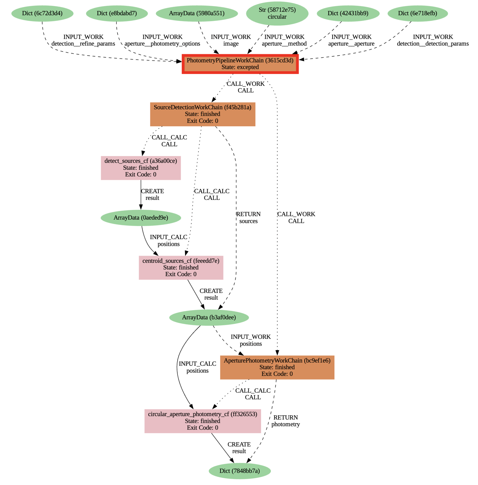

# Astronomical Photometry with AiiDA

<b>Goal:</b> Use AiiDA for a typical photometry workflow.
The plugin relies heavily on [astropy](https://www.astropy.org/), specially [ccdproc](https://ccdproc.readthedocs.io/en/latest/) and [photutils](https://photutils.readthedocs.io/en/stable/).

### Plugins
Data:
- `fits.data`: Defines FitsData as a SingleFile data type. Main methods:. 

Workflows:
- `images.reduction`: 
- `aperture.photometry`:
- `centroid.detection` :
- `photometry.pipeline` : 

### Workflow example:

### Contact

lucas.fernandez3132@gmail.com
